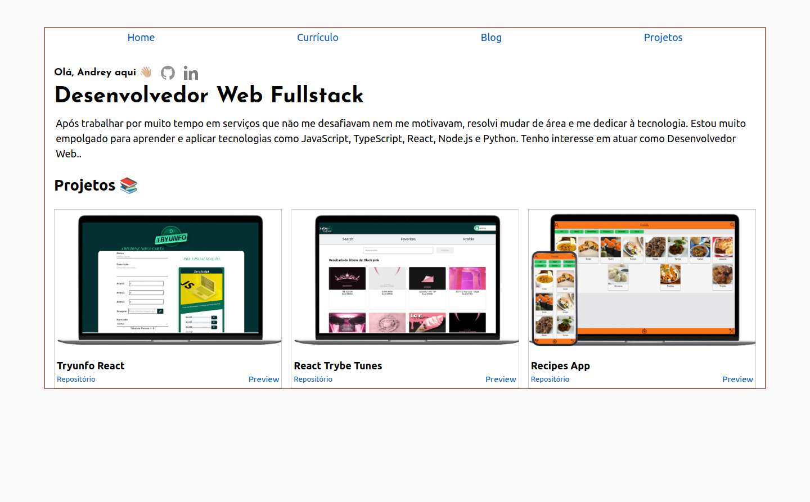

# Portfólio

## Contexto

Esse projeto trata-se de um portfólio com currículo e blog.

<!--
> Utiliza a API 
 -->

<!--
Colegas que contribuíram para a realização do projeto:

- [@colega1](https://github.com/ "github")
- [@colega2](https://github.com/ "github")
 -->

## Técnologias usadas

Front-end:

> Desenvolvido usando: React, Typescript, Next.js, MDX, Css, Github API

## Habilidades

Adquiri essas habilidades ao desenvolver esse projeto:

- Utilizar renderização do lado do servidor;
- Lidar com arquivos MDX;
- Lidar com leitura de arquivos em PDF;
- Utilizar API do Github apresentar meus projetos

## Preview da Aplicação

|  |  
| :---: |
